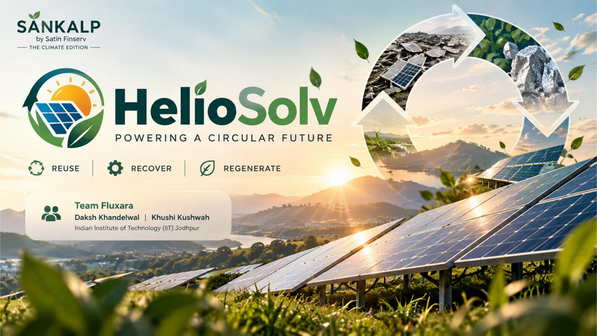
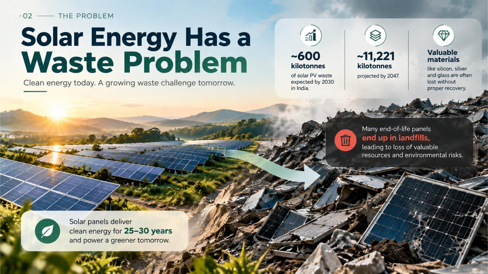
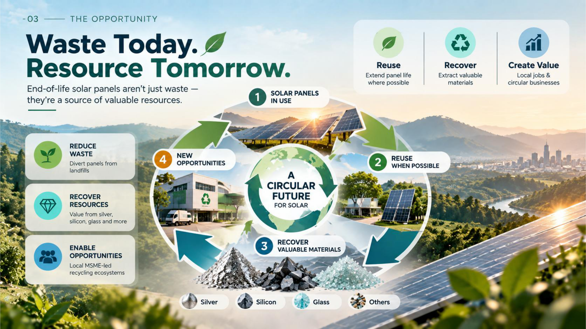
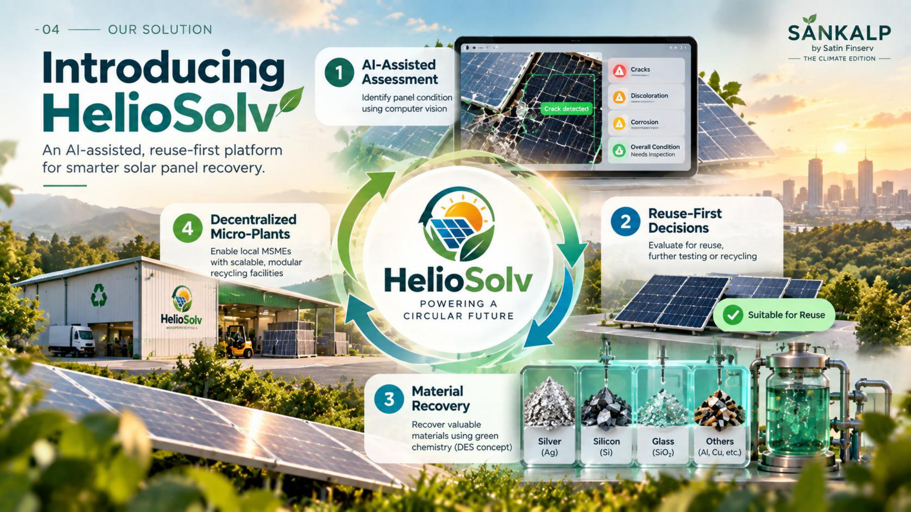
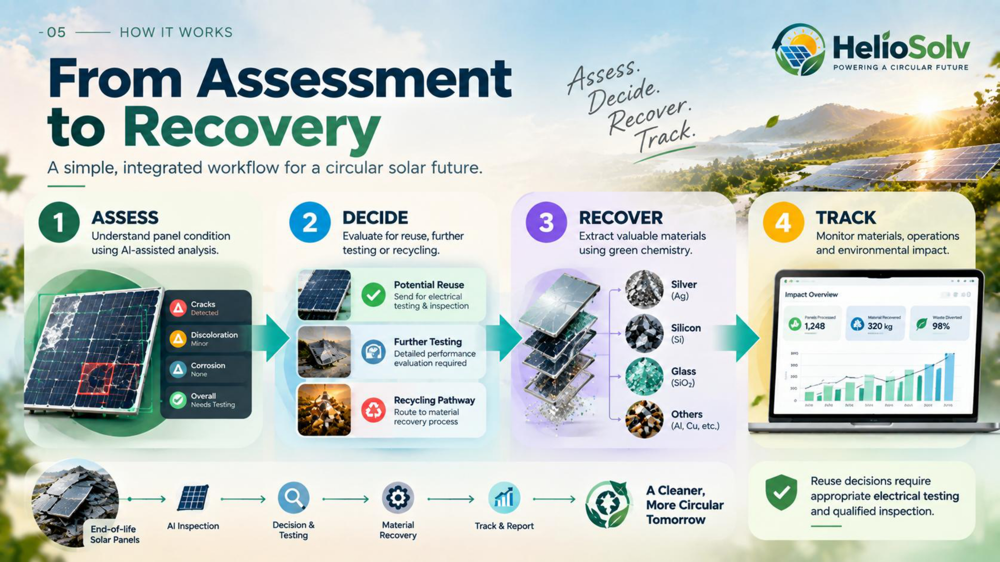
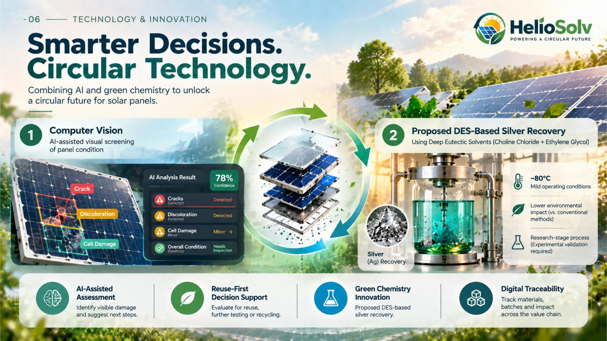
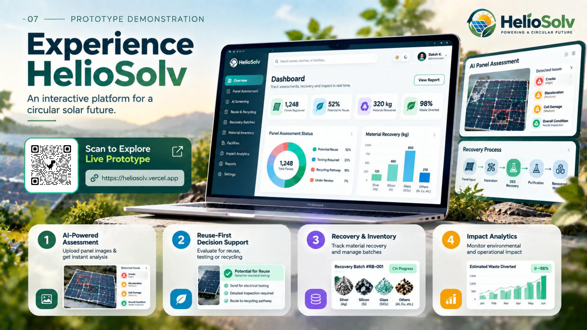
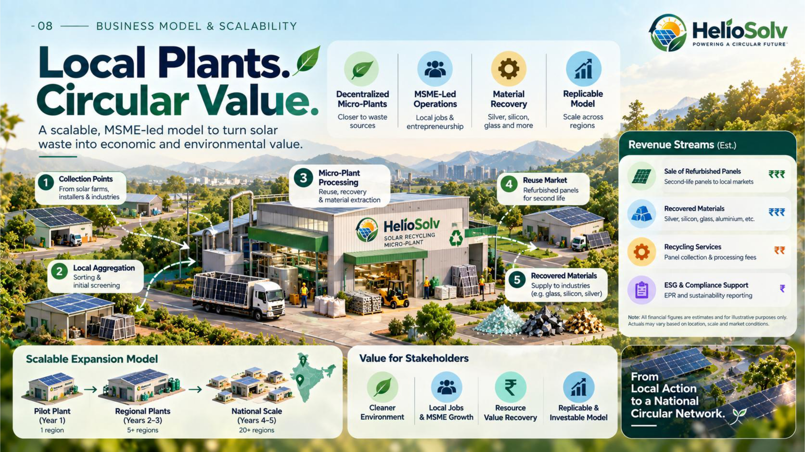
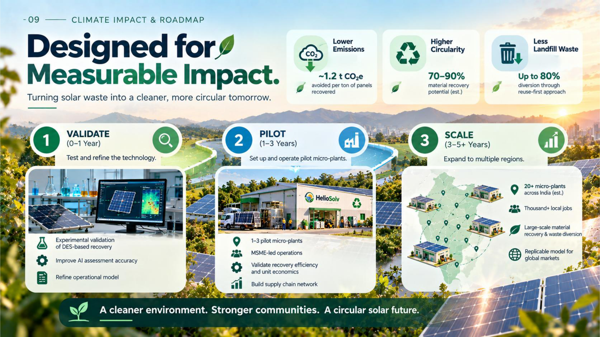
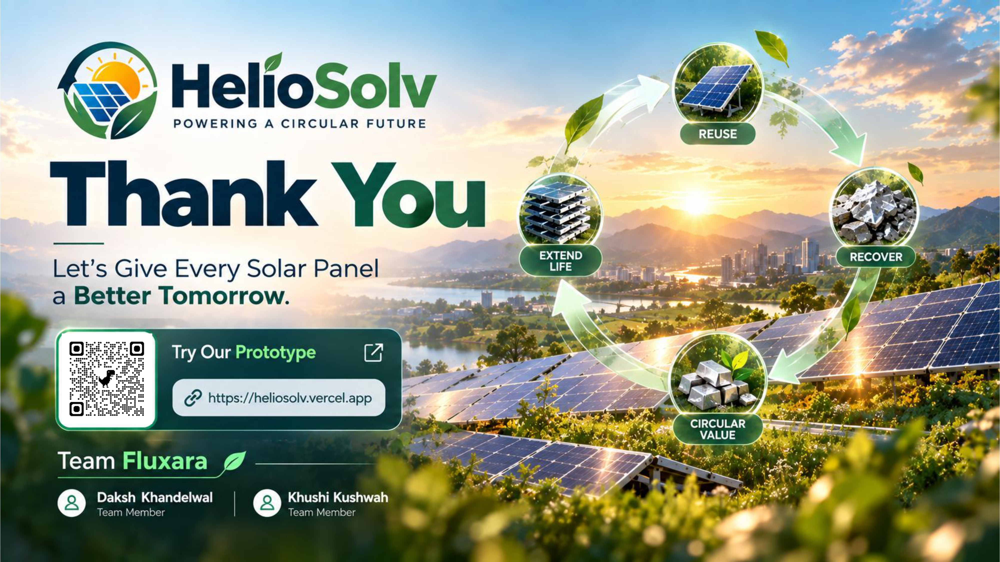

<div align="center">

<br/>

# ☀️ HelioSolv

### *Powering a Circular Future*

**An AI-assisted, reuse-first solar panel assessment and circular recovery platform concept.**

<br/>


**♻️ Reuse &nbsp;|&nbsp; ⚙️ Recover &nbsp;|&nbsp; 🌿 Regenerate**

<br/>

[🌐 Explore the Prototype](https://heliosolv.vercel.app) &nbsp;•&nbsp; [🖼️ Pitch Deck Gallery](#-heliosolv--10-slide-pitch-deck-gallery) &nbsp;•&nbsp; [🚀 Getting Started](#-getting-started) &nbsp;•&nbsp; [👥 Team](#-meet-team-fluxara)

</div>

---

## 📑 Table of Contents

[About](#-about-heliosolv) · [Problem](#️-the-problem) · [Solution](#️-our-solution) · [Features](#-key-features) · [How It Works](#️-how-it-works) · [Tech Stack](#️-technology-stack) · [Pitch Deck](#-heliosolv--10-slide-pitch-deck-gallery) · [Prototype](#-explore-the-prototype) · [Business Model](#-business-model--scalability) · [Impact & Roadmap](#-climate-impact--roadmap) · [Structure](#-repository-structure) · [Getting Started](#-getting-started) · [Status](#-project-status) · [Team](#-meet-team-fluxara)

---

## 🌱 About HelioSolv

Solar panels deliver clean energy for roughly 25–30 years, but the panels retired from service become a growing waste challenge. HelioSolv is a concept for assessing end-of-life panels so that those that may still be useful are considered for **reuse first**, and the rest are routed toward **material recovery**. It pairs AI-assisted visual screening with reuse-first decision support, a proposed green-chemistry recovery pathway, and digital traceability. Its delivery model is a network of **decentralized recycling micro-plants** that local MSMEs could operate.

- 🔍 **Assess** panel condition with AI-assisted visual screening.
- ♻️ **Reuse first**, subject to electrical testing and qualified inspection.
- 🧪 **Recover** materials such as silver, silicon and glass from panels unsuitable for reuse.
- 📊 **Track** materials, batches and impact across the workflow.
- 🏭 **Localize** processing through MSME-led micro-plants.

---

## ♻️ The Problem

Solar energy is clean to generate, but its end-of-life stage is poorly managed.

- 📈 **A fast-growing waste stream:** the pitch deck cites roughly **~600 kilotonnes** of solar PV waste expected in India by 2030, and about **~11,221 kilotonnes** projected by 2047.
- 🗑️ **Lost value:** many end-of-life panels end up in landfills, so materials such as silicon, silver and glass are lost without proper recovery.
- 🔧 **Reusable panels are not identified:** without a structured way to assess condition, panels that could have a second life are treated as waste.
- 📍 **Few local options:** responsible collection, assessment and recovery need to be scalable and accessible close to where panels are retired.

---

## ☀️ Our Solution

HelioSolv is an integrated, AI-assisted, **reuse-first** platform for smarter solar panel recovery.

<table>
  <tr>
    <td align="center" width="20%">🧠<br/><b>AI-Assisted Assessment</b><br/><sub>Computer-vision-supported visual screening of panel condition.</sub></td>
    <td align="center" width="20%">♻️<br/><b>Reuse-First Decisions</b><br/><sub>Helps identify panels that may suit continued use, subject to inspection and electrical testing.</sub></td>
    <td align="center" width="20%">🧪<br/><b>Material Recovery</b><br/><sub>Proposed green-chemistry (DES) recovery for panels unsuitable for reuse.</sub></td>
    <td align="center" width="20%">🔗<br/><b>Digital Traceability</b><br/><sub>Tracks materials, batches and impact across the workflow.</sub></td>
    <td align="center" width="20%">🏭<br/><b>Decentralized Micro-Plants</b><br/><sub>Locally operated processing with potential MSME participation.</sub></td>
  </tr>
</table>

> 💡 **Concept vs. prototype:** The web prototype in this repository demonstrates the assessment, triage, recovery-tracking and analytics *workflows*. The DES-based recovery chemistry, micro-plant network and financial figures are **proposed concepts** that have not been validated. See [Project Status](#-project-status).

---

## 🚀 Key Features

The features below were checked against the source code in this repository.

| Area | What the prototype includes |
|---|---|
| 🏠 **Landing & Methodology** | Marketing landing page (problem, solution, technology, economics) and a methodology page. |
| 🔐 **Authentication** | Login and registration pages. Supabase email/password auth is wired in when Supabase credentials are configured. Otherwise the app uses a simulated **Demo Mode** session with role switching. |
| 📊 **Dashboard** | Overview dashboard with charts (Recharts) and sidebar navigation across all modules. |
| 🧠 **AI Panel Screening** | Panel intake form, defect overlays, estimated efficiency retention, confidence score and a recommended pathway. *Prototype note:* without an external vision endpoint, results come from a **deterministic simulated heuristic**, not a trained model. An optional hook for an external vision API is included. |
| 🖼️ **Image Input** | Panel images are supplied by **image URL** (with preset samples). |
| ♻️ **Reuse Triage Gateway** | Triage workflow for reuse, further testing or recycling, with electrical test data logging and a printable view. |
| 🧪 **Recovery Batches** | Batch tracking interface for the proposed DES-based recovery process. |
| 🏭 **Micro-Plant Operations** | Interface for monitoring decentralized micro-plant facilities. |
| 📦 **Material Inventory** | Inventory view for recovered materials. |
| 🌍 **Environmental Impact** | Impact analytics and visualizations. |
| 💰 **MSME Unit Economics** | Illustrative unit-economics calculator and finance view. |
| 📄 **Reports** | Printable report/certificate view (via the browser print function). |
| 🎨 **UI/UX** | Light and dark mode, responsive layout, animated interface. |
| 🗄️ **Database Schema** | A Supabase/PostgreSQL schema (`supabase/schema.sql`) with Row Level Security policies is provided. |

> ⚠️ In Demo Mode, application data is kept in the browser (local storage). The code does not yet read or write dashboard data to Supabase tables, so no live database persistence is claimed.

---

## ⚙️ How It Works

<div align="center">

**Assess ➜ Decide ➜ Recover ➜ Track**

</div>

<table>
  <tr>
    <td align="center" width="25%"><h3>1️⃣ Assess</h3>Review the panel's visible condition using AI-assisted analysis.</td>
    <td align="center" width="25%"><h3>2️⃣ Decide</h3>Support reuse-first decisions. Reuse requires appropriate electrical testing and qualified inspection.</td>
    <td align="center" width="25%"><h3>3️⃣ Recover</h3>Route panels unsuitable for reuse toward the proposed material recovery pathway.</td>
    <td align="center" width="25%"><h3>4️⃣ Track</h3>Monitor materials, batches, operations and impact through the dashboard.</td>
  </tr>
</table>

---

## 🛠️ Technology Stack


| Layer | Technologies |
|---|---|
| **Framework** | Next.js 14 (App Router), React 18, TypeScript |
| **Styling & UI** | Tailwind CSS, `next-themes` (light/dark), Lucide icons, Framer Motion, `canvas-confetti` |
| **Data visualization** | Recharts |
| **Validation & utilities** | Zod, `clsx`, `tailwind-merge` |
| **Auth & database** | Supabase client libraries (`@supabase/supabase-js`, `@supabase/ssr`). Auth calls are implemented, and a PostgreSQL schema with RLS policies is provided. |
| **AI screening** | Simulated edge heuristic in `lib/ai-service.ts`, with an optional external vision API endpoint configurable via environment variables |
| **Hosting** | The pitch deck lists a Vercel-hosted prototype link |

---

## 🖼️ HelioSolv — 10-Slide Pitch Deck Gallery

<div align="center">

<table>
  <tr>
    <td align="center" width="50%">
      <b>Slide 1 — Introduction: HelioSolv — Powering a Circular Future</b><br/><br/>
      <br/>
      <sub>Introduces HelioSolv, Team Fluxara and the SANKALP 2026 competition.</sub>
    </td>
    <td align="center" width="50%">
      <b>Slide 2 — The Problem: Solar Energy Has a Waste Problem</b><br/><br/>
      <br/>
      <sub>Highlights the end-of-life solar panel waste challenge and the need for responsible management.</sub>
    </td>
  </tr>
  <tr>
    <td align="center" width="50%">
      <b>Slide 3 — The Opportunity: Waste Today. Resource Tomorrow.</b><br/><br/>
      <br/>
      <sub>Shows the potential of extending panel life, recovering materials and enabling circular-economy opportunities.</sub>
    </td>
    <td align="center" width="50%">
      <b>Slide 4 — Our Solution: Introducing HelioSolv</b><br/><br/>
      <br/>
      <sub>Presents the integrated AI-assisted, reuse-first assessment and circular recovery concept.</sub>
    </td>
  </tr>
  <tr>
    <td align="center" width="50%">
      <b>Slide 5 — How It Works: From Assessment to Recovery</b><br/><br/>
      <br/>
      <sub>Explains the workflow: Assess → Decide → Recover → Track.</sub>
    </td>
    <td align="center" width="50%">
      <b>Slide 6 — Technology &amp; Innovation: Smarter Decisions. Circular Technology.</b><br/><br/>
      <br/>
      <sub>Showcases computer vision, reuse-first decision support, proposed DES-based recovery and digital traceability.</sub>
    </td>
  </tr>
  <tr>
    <td align="center" width="50%">
      <b>Slide 7 — Prototype Demonstration: Experience HelioSolv</b><br/><br/>
      <br/>
      <sub>Introduces the interactive web prototype and the features shown in the pitch deck.</sub>
    </td>
    <td align="center" width="50%">
      <b>Slide 8 — Business Model &amp; Scalability: Local Plants. Circular Value.</b><br/><br/>
      <br/>
      <sub>Presents the decentralized micro-plant concept, MSME participation and potential revenue opportunities.</sub>
    </td>
  </tr>
  <tr>
    <td align="center" width="50%">
      <b>Slide 9 — Climate Impact &amp; Roadmap: Designed for Measurable Impact</b><br/><br/>
      <br/>
      <sub>Describes the intended climate benefits and the Validate → Pilot → Scale roadmap.</sub>
    </td>
    <td align="center" width="50%">
      <b>Slide 10 — Thank You</b><br/><br/>
      <br/>
      <sub>Closes the presentation with the HelioSolv vision and Team Fluxara.</sub>
    </td>
  </tr>
</table>

</div>

---

## 💻 Explore the Prototype

The interactive web prototype demonstrates the HelioSolv workflow: panel screening, reuse triage, recovery batches, inventory, impact analytics and reporting. It runs in **Demo Mode** by default, so no backend setup is needed to explore it.

<div align="center">

### 🌐 [**Explore the HelioSolv Prototype**](https://heliosolv.vercel.app)

<sub>Prototype link as listed in the SANKALP 2026 pitch deck.</sub>

</div>

---

## 📈 Business Model & Scalability

HelioSolv proposes a **decentralized, MSME-led** model instead of a single centralized plant.

- 🏭 **Decentralized micro-plants** located closer to waste sources.
- 🤝 **Potential MSME-led operations** supporting local jobs and entrepreneurship.
- 🧪 **Material recovery** of silver, silicon, glass, aluminium and more.
- 🔁 **Replicable local model** that can be repeated across regions.
- 📍 **Gradual expansion after pilot validation.** The deck sketches a *pilot plant* (Year 1), *regional plants* (Years 2–3) and a *national network* (Years 4–5) as an expansion model.

**Proposed revenue streams (estimates):** refurbished panel sales, recovered materials, recycling services (collection and processing fees), and ESG/compliance support (EPR and sustainability reporting).

> 📝 **Disclaimer:** All financial figures in the pitch deck and prototype are **estimates for illustrative purposes only**. They are not achieved revenue or validated profit, and actual results would vary with location, scale and market conditions.

---

## 🌍 Climate Impact & Roadmap

HelioSolv is **designed** to support:

- ♻️ Reuse where appropriate, after proper testing
- 🧪 Responsible material recovery
- 🔄 Higher material circularity
- 🏭 Decentralized, local processing
- 🔗 Better visibility across recovery workflows

> 📌 **Pitch-deck impact estimates (projections, not measured results):** about ~1.2 t CO₂e avoided per ton of panels recovered, 70–90% material recovery potential (est.), and up to 80% diversion through a reuse-first approach. These have not been measured or independently validated.

<div align="center">

**Validate ➜ Pilot ➜ Scale**

</div>

| Stage | Timeline (per deck) | Focus |
|---|---|---|
| 🔬 **Validate** | 0–1 year | Test and refine the technology: experimental validation of DES-based recovery, improved AI assessment accuracy and a refined operating model. |
| 🏗️ **Pilot** | 1–3 years | Set up and operate pilot micro-plants with MSME-led operations. Validate recovery efficiency and unit economics. |
| 📈 **Scale** | 3–5+ years | Explore expansion to multiple regions through decentralized facilities, after successful validation. |

---

## 📁 Repository Structure

```text
HelioSolv/
├── app/                          # Next.js App Router
│   ├── page.tsx                  # Landing page
│   ├── layout.tsx                # Root layout and providers
│   ├── globals.css               # Global styles
│   ├── methodology/              # Methodology page
│   ├── auth/
│   │   ├── login/                # Sign-in page
│   │   └── register/             # Registration page
│   └── dashboard/
│       ├── layout.tsx            # Dashboard shell and navigation
│       ├── page.tsx              # Overview
│       ├── assessment/           # AI panel screening
│       ├── triage/               # Reuse triage gateway
│       ├── batches/              # Recovery batches
│       ├── micro-plants/         # Micro-plant operations
│       ├── inventory/            # Material inventory
│       ├── impact/               # Environmental impact analytics
│       ├── finance/              # MSME unit economics
│       ├── reports/              # Printable reports
│       └── settings/             # Settings and integrations
├── components/                   # Navbar, footer, theme toggle, hero particles
├── lib/
│   ├── ai-service.ts             # AI screening service (simulated heuristic + optional endpoint)
│   ├── supabase.ts               # Supabase client (enabled only when configured)
│   ├── store.ts                  # Demo data and state
│   ├── demo-context.tsx          # Demo Mode context (browser-persisted)
│   ├── types.ts                  # TypeScript types
│   └── utils.ts                  # Helpers
├── supabase/
│   └── schema.sql                # PostgreSQL schema with RLS policies
├── assets/                       # Pitch deck slide images (to be added)
│   ├── slide-01.jpg
│   ├── slide-02.jpg
│   ├── slide-03.jpg
│   ├── slide-04.jpg
│   ├── slide-05.jpg
│   ├── slide-06.jpg
│   ├── slide-07.jpg
│   ├── slide-08.jpg
│   ├── slide-09.jpg
│   └── slide-10.jpg
├── HelioSolv_SANKALP_2026_Pitch_Deck.pdf
├── SANKALP Waste Management Innovation.pdf   # Supporting research report
├── .env.example                  # Environment variable template (no secrets)
├── next.config.mjs               # Next.js configuration
├── tailwind.config.ts            # Tailwind theme
├── postcss.config.mjs
├── tsconfig.json
├── package.json
└── package-lock.json
```

---

## 🚀 Getting Started

**Prerequisites:** Node.js (a version compatible with Next.js 14) and npm.

**1. Clone the repository**

```bash
git clone https://github.com/dk-khandelwal06/HelioSolv.git
cd HelioSolv
```

**2. Install dependencies** (the repository uses `package-lock.json`, so npm)

```bash
npm install
```

**3. Configure environment variables (optional)**

```bash
cp .env.example .env.local
```

The app runs in **Demo Mode** with the default or empty values. To enable Supabase authentication, set these in `.env.local`:

| Variable | Purpose |
|---|---|
| `NEXT_PUBLIC_SUPABASE_URL` | Your Supabase project URL |
| `NEXT_PUBLIC_SUPABASE_ANON_KEY` | Your Supabase anon (public) key |
| `NEXT_PUBLIC_APP_MODE` | `demo` or `production` |
| `AI_VISION_ENDPOINT` / `AI_VISION_API_KEY` | *Optional.* External vision service. Without them, the simulated screening is used. |

To use the database schema, run `supabase/schema.sql` in your Supabase SQL editor.

> 🔒 **Security:** Never commit secret keys, passwords, tokens or private environment values to GitHub. Keep them in `.env.local`, which is git-ignored, and never expose a service-role key in client code.

**4. Run the development server**

```bash
npm run dev
```

Open [http://localhost:3000](http://localhost:3000) in your browser.

**5. Build and run in production mode**

```bash
npm run build
npm run start
```

**6. Deploy to Vercel**

Next.js projects deploy to Vercel directly. Import the GitHub repository in Vercel and add any environment variables in the project settings.

---

## 📌 Project Status

| Area | Status |
|---|---|
| ✅ Web prototype (landing page, dashboard modules, light/dark mode, responsive UI) | **Implemented** |
| ✅ Supabase auth integration and database schema | **Implemented in code**, used when credentials are configured |
| ✅ Demo Mode with simulated, browser-persisted data | **Implemented** |
| 🧪 AI panel screening | **Simulated in the prototype.** A trained computer-vision model is not included. |
| 🔬 DES-based silver recovery (choline chloride + ethylene glycol, ~80 °C) | **Proposed, research-stage.** Experimental validation required. |
| 🏭 Decentralized micro-plants and MSME model | **Proposed concept.** Pilot validation required. |
| 💹 Financial and climate-impact figures | **Estimates and projections, not measured results** |
| 🚧 Live database persistence for dashboard data | **Planned** |
| 🚧 Validate → Pilot → Scale | **Future activity** |

HelioSolv is a competition prototype and concept. It is not presented as production-ready, scientifically validated or commercially operational.

---

<div align="center">

## 👥 Meet Team Fluxara

<table>
  <tr>
    <td align="center" width="50%">
      <h3>Daksh Khandelwal</h3>
      📧 <a href="mailto:dk.khandelwaliitj@gmail.com">dk.khandelwaliitj@gmail.com</a><br/>
      🐙 <a href="https://github.com/dk-khandelwal06">GitHub</a><br/>
      💼 <a href="https://www.linkedin.com/in/daksh-khandelwal-b02748391/">LinkedIn</a>
    </td>
    <td align="center" width="50%">
      <h3>Khushi Kushwah</h3>
      📧 <a href="mailto:khushikushwah213@gmail.com">khushikushwah213@gmail.com</a><br/>
      🐙 <a href="https://github.com/khushikushwah213">GitHub</a><br/>
      💼 <a href="https://www.linkedin.com/in/khushi-kushwah-94420b421/">LinkedIn</a>
    </td>
  </tr>
</table>

</div>

---

<div align="center">

## 🌍 Let's Give Every Solar Panel a Better Tomorrow.

<br/>

**HelioSolv | Team Fluxara | SANKALP 2026 — The Climate Edition**

</div>
